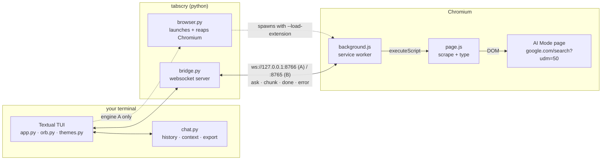
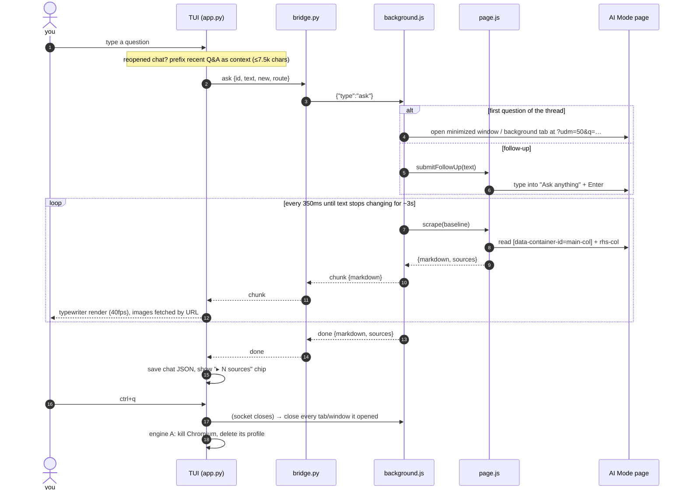

# tabscry

*Scry into a browser tab* — Google **AI Mode** in your terminal. A Chromium extension drives the real
AI Mode page and streams it back to a Textual TUI over a local websocket. The browser is either one
tabscry launches and owns (default) or your own signed-in one.

## Architecture



Two engines, same extension:

| | **A. tabscry's browser** (default) | **B. your browser** |
| --- | --- | --- |
| who runs Chromium | tabscry (throwaway profile, unthrottled) | you (Dia/Chrome/Chromium) |
| Google session | signed out | your signed-in one |
| answers stall when hidden | no | possible — browsers throttle pages you can't see |
| setup | `tabscry --install-browser` | load `extension/` unpacked |

## A question, end to end



## Setup
tabscry can drive Google AI Mode two ways:

**A. tabscry's own browser (default).** It launches its own Chromium with its own profile and
throttling disabled, so answers never stall and your browser is never touched.
```
tabscry --install-browser   # one-off, ~190MB Chrome for Testing into ~/.local/share/tabscry/chromium
tabscry
```
(Any Chromium that still honours `--load-extension` works: `/Applications/Chromium.app`, a Chrome for
Testing build, or `TABSCRY_CHROME=/path/to/binary`. Branded Google Chrome 137+ does not.)

**B. the extension in your own browser** — uses your signed-in Google session.
1. Dia/Chrome/Chromium → `chrome://extensions` → enable Developer mode → **Load unpacked** → pick `extension/`.
2. `/engine` in the TUI to switch (restart tabscry to apply).

Then: `uv tool install -e .`

## Use
- `tabscry` — chat TUI. Answers type out as they stream; images render inline (Kitty graphics in Ghostty/Kitty/WezTerm, sixel or half-blocks elsewhere).

  | key | |
  | --- | --- |
  | `ctrl+n` / `/new` | new chat |
  | `ctrl+r` / `/history` | browse, filter, reopen or delete saved chats |
  | `ctrl+s` / `/export [path]` | save chat as markdown |
  | `ctrl+o` / `/open` | show the AI Mode page in your browser |
  | `ctrl+t` / `/theme [dusk\|saffron\|ember\|mono]` | switch colour theme (remembered) |
  | `ctrl+b` / click `▸ N sources` | open/close the sources drawer on the right (`esc` closes) |
  | `/font [name]` + `tabscry --font [name]` | open tabscry in a new Ghostty window with a chosen font (default [ABC Areal Mono](https://abcdinamo.com/free/areal), free but emailed after a form) |
  | `/engine` | switch between tabscry's own browser and the extension in yours (restart to apply) |
  | `/route` | switch between a minimized window (default) and a background tab (remembered) |
  | `/icons` | toggle emoji ↔ Nerd Font icons (display only; needs a Nerd Font — Ghostty has one built in) |
  | `ctrl+q` / `/quit` | quit |

- `tabscry "question"` — one-shot, prints markdown (images as URLs). `--continue` to follow up in the same Google page.

Chats are saved as small JSON files in `~/.local/share/tabscry/chats/` (override with `TABSCRY_HOME`) — text,
sources and image *URLs* only; images are re-fetched when shown. When you ask something in a reopened chat,
Google gets a fresh thread, so tabscry replays the recent Q&A (up to ~7.5k chars, newest first) as context
with your question; the answer label shows `↺ N earlier turns as context`.

## How it works / caveats
- With the extension in your own browser, Google runs in its own window, created already-minimized, so your own windows and tabs are untouched (`/route` switches to an inactive tab in your current window instead, e.g. if a browser brings that window forward). Everything tabscry opened is closed as soon as the TUI session ends; one-shot runs keep it until the next session so `--continue` works. The scraper (`extension/page.js`) is injected only into that page.
- The extension scrapes `[data-container-id="main-col"]` (answer) and `rhs-col` (sources) and converts to markdown; an answer is "done" once it stops changing for ~3s.
- Quizzes ("quiz me on …") are extracted as data — questions, options, the correct answer, Google's per-option explanations and hints — and played in the TUI: click an option (or focus the quiz and press `a`–`d`), `h` for a hint, `←`/`→` between questions, `esc` back to the prompt. Answers lock in and the score is kept. Exports include the quiz with answers marked; replayed context includes the questions without the answers.
- Follow-ups are typed into the visible "Ask anything" box via synthetic input + Enter, then confirmed: if Google doesn't take it within a few seconds, tabscry retries pressing Send; if it still doesn't go through (or no answer arrives within 45s), the TUI re-asks it as a new thread with the chat replayed as context and tells you.
- It's scraping Google's DOM — when Google ships a redesign, fix `scrape()` / `submitFollowUp()` in `extension/page.js`.
- If Google shows a captcha/consent page, `/open` the tab and clear it.
- `ERR_CONNECTION_REFUSED` in the extension's error log just means the TUI isn't running; it retries with backoff (up to 30s).
- After editing `extension/`: engine A reinstalls it automatically (its copy is versioned by a hash of the files); engine B needs reload on the extension card.
- ABC Areal Mono ships without the "monospaced" flags, so Ghostty won't offer it until you set them:
  `uvx --with fonttools python -c "from fontTools.ttLib import TTFont; import pathlib\n[(lambda f: (f.__setitem__('post', f['post']), setattr(f['post'],'isFixedPitch',1), setattr(f['OS/2'].panose,'bProportion',9), f.save(p)))(TTFont(p)) for p in map(str, pathlib.Path.home().glob('Library/Fonts/ABCArealMono-*.ttf'))]"`
  then move the files out of `~/Library/Fonts` and back to refresh macOS's font cache.
- A TUI can't set the terminal's font, so `--font` launches a fresh Ghostty window with `--font-family` instead of touching your Ghostty config. Use the *Mono* cut of any font; Ghostty keeps its built-in Nerd Font symbols as fallback, so the icons survive.
- One tabscry per port: the port is claimed with a lock file in `~/.local/share/tabscry/`, so a second instance exits with "already running" instead of killing the first one's browser and stealing its extension. Set `TABSCRY_ENGINE_PORT` to run two at once.
- tabscry's own browser is handed a per-session token, patched into its extension copy; the bridge rejects any other browser that dials the port (close code 4001) and refuses a second one while one is connected (4003, retried a second later). If a service worker is asleep when you ask something, the TUI waits up to 25s for it to dial back before erroring.
- Ports: `TABSCRY_PORT` (your browser, default 8765), `TABSCRY_ENGINE_PORT` (tabscry's own browser, default 8766) — separate so both can be loaded at once.
- tabscry's own browser gets a throwaway profile per run (a reused profile keeps Chrome's installed copy of the extension, so edits never take effect), and any browser left from an earlier run is killed on start. It's unthrottled (`--disable-background-timer-throttling`, `--disable-backgrounding-occluded-windows`, `--disable-renderer-backgrounding`), so answers stream even though nothing is visible; it's signed out, and it's killed when the TUI exits.
- One-shot runs with the sandboxed engine start and stop the browser per command, so `--continue` only keeps context in engine B (your browser).

## Future work

### ~~Sandboxed browser engine~~ — shipped as engine A
Driving AI Mode in *your* browser means Chromium throttles the page whenever it thinks you can't see
it (background tab, minimized/occluded window), so answers stall until you look — and an extension
can't turn that off. Engine A launches its own Chromium with throttling disabled instead.

- **Still open:** it runs headful-but-hidden (a minimized window in its own instance), not headless.
  Headless would be tidier but is likelier to trip Google's bot detection, and hasn't been tried.
  If it ever does get flagged, a stealth build ([Camoufox](https://github.com/daijro/camoufox),
  Patchright) is the fallback — Camoufox is Firefox-based, beta, and aimed at fingerprinting
  defences rather than Google's IP/rate heuristics, so it's a last resort rather than a first step.

### Docker engine
Run Chromium + the extension inside a container on an Xvfb virtual display, relayed to the TUI, with
a VNC page to watch it. Stronger isolation and an always-visible window (so throttling can't apply at
all), at the cost of Docker Desktop running (~1-2GB) and an ARM64 image. Worth it if the local engine
still stalls, or to run tabscry's browser on a server.
